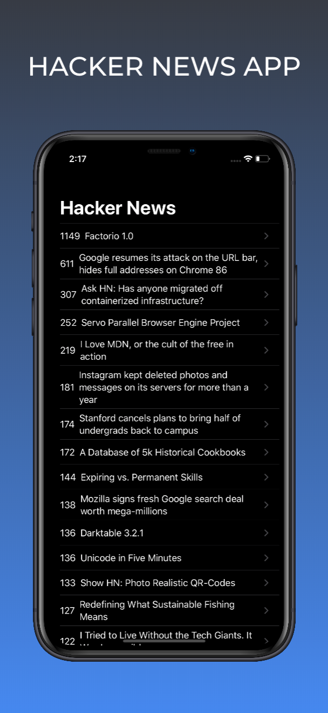
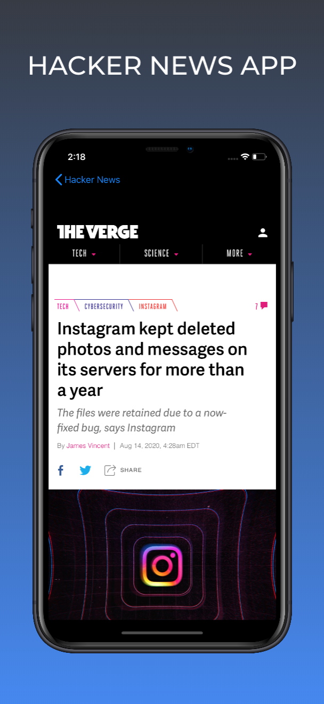
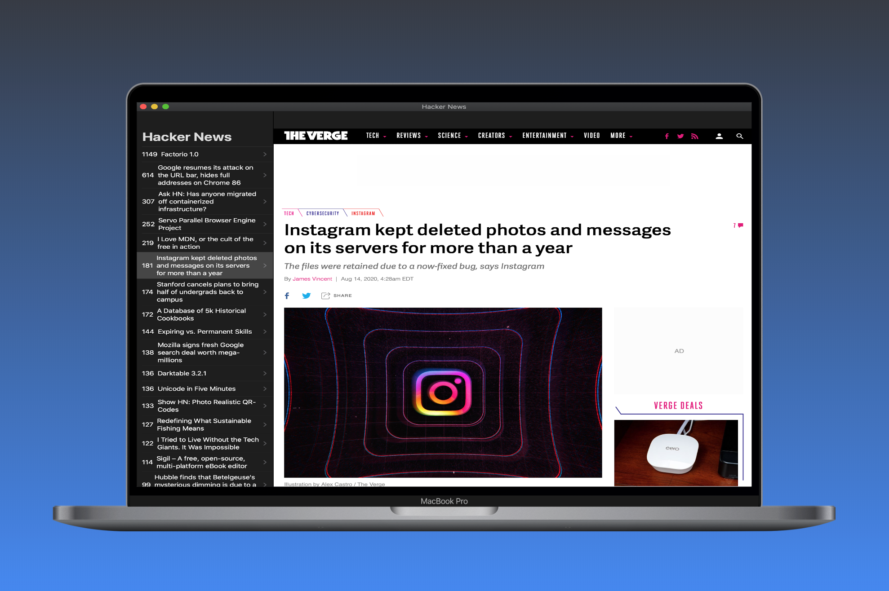

# HackerNews
> News app to read the latest articles about computer science and entrepreneurship.

* App using SwiftUI
* Hacer News API
* @State management using Observer Design Patter
* SwiftUI modifiers to set properties for components
* SwiftUI Stacks
* SwiftUI List and DetailView
* Identifiable and Decodable protocol
* WebKit to display web pages
* SubView
* Navigation View
* Networking and URLSession
* JSON decoding

> Project Catalyst to create a macOS app from an iOS app.

